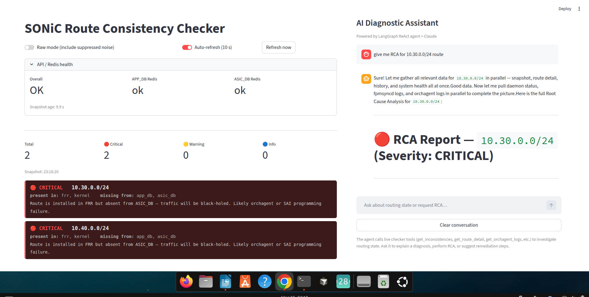

# SONiC Route Consistency Checker + AI Agent

**Built entirely with Claude Code** &nbsp;|&nbsp; Python &nbsp;|&nbsp; SONiC &nbsp;|&nbsp; LangGraph &nbsp;|&nbsp; Streamlit

---

Cross-plane route inconsistencies in SONiC are invisible until traffic breaks. A route can exist in FRR's RIB and never reach the ASIC because fpmsyncd dropped it, orchagent failed to program it, or a SAI call returned an error silently. This project compares all four routing planes in real time — FRR RIB, APP\_DB, ASIC\_DB, and the Kernel FIB — flags inconsistencies by severity, and drives a LangGraph ReAct agent backed by Claude to identify the root cause and recommend remediation. What would take an engineer 20 minutes of `redis-cli`, `vtysh`, and log spelunking takes the agent under 40 seconds.

---


*Dashboard screenshot — inconsistency table (left) + AI agent RCA chat (right)*

---

## Features

- Real-time consistency checking across all four SONiC routing planes
- Noise filtering: SAI-internal OID entries, management-plane routes, loopback prefixes, IPv6 link-local ghosts
- AI agent with 12 diagnostic tools that autonomously traces root cause from symptom to fix
- Fault injection suite covering fpmsyncd gaps, SAI programming failures, stale ASIC entries, and nexthop mismatches
- Streamlit dashboard with streaming token output — first answer tokens appear within 2–3 seconds of tool calls completing

---

## How It Works

SONiC programs routes through a sequential pipeline:

```
FRR (zebra/bgpd)
    │  FPM socket (TCP :2620)
    ▼
fpmsyncd ──────────────────────► APP_DB (Redis DB 0)
                                         │  orchagent reads
                                         ▼
                                 SAI driver / syncd
                                         │
                                         ▼
                                 ASIC_DB (Redis DB 1) → hardware forwarding

FRR (zebra) ──► netlink ──► Kernel FIB  (parallel path)
```

Each handoff is a failure point. `FRR present, APP_DB absent` means fpmsyncd isn't processing the route. `APP_DB present, ASIC_DB absent` means orchagent or the SAI call failed. The checker collects state from all four planes, diffs them, and classifies each gap by severity. The agent then calls targeted diagnostic tools — logs, daemon status, BGP neighbors, traceroute — to explain why.

---

## Quick Start

**Prerequisites**
- `docker-sonic-vs` container running with ports `-p 6379:6379 -p 8000:8000 -p 8501:8501`
- Python 3.12+ on host
- Anthropic API key from [console.anthropic.com](https://console.anthropic.com)

**Setup**

```bash
git clone <repo>
cd sonic-route-checker
python3 -m venv .venv && source .venv/bin/activate
pip install streamlit langgraph langchain-anthropic langchain-core httpx requests
```

**Run**

```bash
export ANTHROPIC_API_KEY=sk-ant-...
./start.sh
```

`start.sh` handles everything: eth0 link check, test route injection, FastAPI startup inside the container, and Streamlit launch on the host at port 8502.

Open `http://localhost:8502` for the dashboard, `http://localhost:8000/docs` for the API.

---

## Fault Injection Demo

```bash
# See all available scenarios
python3 tests/fault_inject.py list

# Inject: stop fpmsyncd and add a route FRR can see but APP_DB cannot
python3 tests/fault_inject.py fpmsyncd_gap

# Dashboard auto-refreshes in 10s — a new CRITICAL entry appears for 10.50.0.0/24

# In the dashboard chat panel:
# "give me RCA for 10.50.0.0/24"

# Agent response (streaming, ~30s): identifies fpmsyncd STOPPED,
# route stuck before APP_DB, recommends: supervisorctl start fpmsyncd

# Restore
python3 tests/fault_inject.py fpmsyncd_gap --restore
```

| Scenario | Prefix | Break | Severity |
|---|---|---|---|
| `fpmsyncd_gap` | 10.50.0.0/24 | FRR present, APP\_DB absent | CRITICAL |
| `sai_failure` | 10.60.0.0/24 | APP\_DB present, ASIC\_DB absent | WARNING |
| `stale_asic` | 10.70.0.0/24 | ASIC\_DB present, others absent | WARNING |
| `nexthop_mismatch` | 10.80.0.0/24 | Nexthop differs between planes | WARNING |

---

## Project Structure

```
sonic-route-checker/
├── checker/
│   ├── collector.py        Route collection from all 4 planes (FRR, APP_DB, ASIC_DB, Kernel)
│   ├── diff_engine.py      Cross-plane diff, severity classification, noise suppression
│   └── api.py              FastAPI server — 5 endpoints, 30s snapshot cache
├── agent/
│   ├── agent.py            LangGraph ReAct graph, streaming API, CLI entry point
│   ├── tools.py            12 diagnostic tools (API calls + subprocess)
│   └── prompts.py          SONiC domain system prompt for Claude
├── dashboard/
│   └── app.py              Streamlit UI — live table (st.fragment) + streaming chat
├── tests/
│   └── fault_inject.py     4 fault scenarios via docker exec, with --restore
├── start.sh                One-command stack startup
├── CLAUDE.md               Full architecture, debugging history, environment details
└── README.md               This file
```

`infra/topology.yaml` (Containerlab multi-node) and `infra/exabgp.conf` are TODO — the demo runs fully on a single SONiC-VS container.

---

## Built With Claude Code

This project was built entirely using [Claude Code](https://claude.ai/code). The development process — architecture decisions, debugging sessions, and all implementation — is captured in `CLAUDE.md`, which serves as the living context file for continued development with Claude.

Notable AI-assisted debugging moments:

- **docker0 NO-CARRIER / nftables**: Docker on Ubuntu 24.04 routes through nftables, not iptables. Host-level `iptables` rules have no effect; container `iptables INPUT` rules are required instead.
- **`"vr"` vs `"vr_id"` in ASIC\_DB keys**: SONiC-VS uses `"vr"` as the VRF field in ASIC\_DB route entry JSON. Standard docs reference `"vr_id"`. The collector handles both.
- **LangGraph streaming content format**: `AIMessageChunk.content` from LangChain-Anthropic is always a `list[dict]` (`[{"type": "text", "text": "..."}]`), never a plain string. `isinstance(content, str)` silently drops every token.
- **`recursion_limit` placement**: `graph.compile(recursion_limit=N)` raises `TypeError`. It must be passed at runtime: `config={"recursion_limit": 25}` in every `.stream()` and `.invoke()` call.
- **Noise suppression rules**: Derived from live observation of SONiC-VS false positives — SAI OID VRF entries, Docker bridge routes, IPv6 link-local ghost entries written by fpmsyncd.

---

## Technical Notes

- **Streamlit runs on the host** (port 8502), not inside the container. The container has no outbound internet access, so Anthropic API calls fail from inside.
- **Ollama tested and rejected**: `qwen2.5-coder:7b` on an i7-10610U / 16 GB took 4m36s per response and hallucinated Redis key formats and DB IDs. `claude-sonnet-4-6` via the Anthropic API is the only model used.
- **Full SONiC-VS quirks**: ASIC\_DB key format, fpmsyncd management-plane filtering, bgpd starting STOPPED, static Null0 routes for test traffic — all documented in `CLAUDE.md`.

---

## License

MIT
